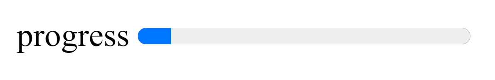

# html-progressbar README

This adds a progress bar to your HTML file.It insert a progress html5 element snippet with label into your existing HTML file.<progress> 

## Features

* type add_progressbar to add a progress bar with label.

## Release Notes

### 1.0.0

Initial release of html-progressbar

-----------------------------------------------------------------------------------------------------------
